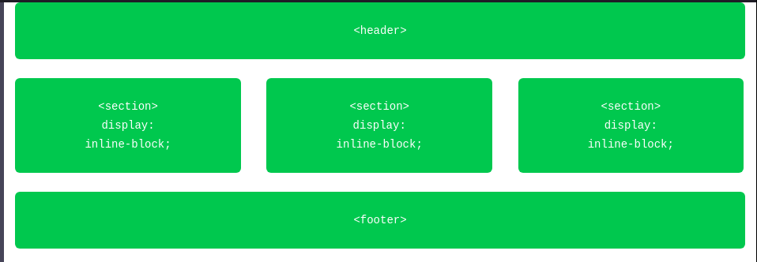

# Positioning Content

The real website layout can be a single column or multiple column. It's not only about creating boxes or working with a single column layout but more about the place your content in a more digestible way.

## Positioning with `inline-block`

We have a `block` level element to create an outline for any section as `block` level element start from new line & take whole available width. But we can convert this multi column by chaning `display: inline-block`.

In above we want `header` & `footer` to be at top & bottom. In between 3 `section` in a one row or 3 column so change its `display: inline-block` of `section` element. So that they accept all the box model properties and will line up one after another on the same line.

