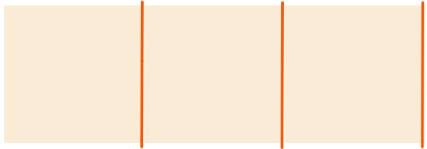
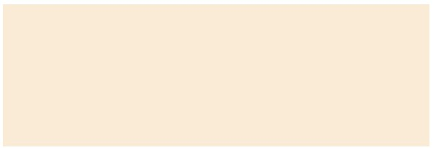
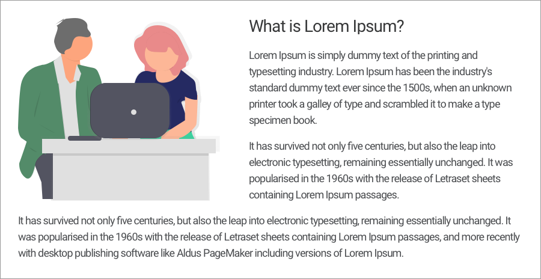

# Positioning Content

The real website layout can be a single column or multiple column. It's not only about creating boxes or working with a single column layout but more about the place your content in a more digestible way.

---

## Positioning with `inline-block`

We have a `block` level element to create an outline for any section as `block` level element start from new line & take whole available width. But we can convert this multi column by chaning `display: inline-block`.


In above we want `header` & `footer` to be at top & bottom. In between 3 `section` in a one row or 3 column so change its `display: inline-block` of `section` element. So that they accept all the box model properties and will line up one after another on the same line.

### Problem With inline-block

When we use `inline-block` to a element it create a `minor space` next to it.



```html
<style>
    * {
        box-sizing: border-box;
    }

    .child {
        display: inline-block;
        width: 200px;
        height: 200px;
        background-color: antiquewhite;
    }
</style>

<div class="container">
    <div class="child"></div>
    <div class="child"></div>
    <div class="child"></div>
</div>
```

### How to solve this problem of inline-block



- #### Using next starting tag in same line

```html
<div class="child"></div><div class="child">
</div><div class="child">
</div>
```

- #### Using Comment Method

```html
    <div class="child"></div><!--
--><div class="child"></div><!--
--><div class="child"></div>
```

- #### Using `font-size: 0` method 

Only work if there is **no content** in items & has to put this on `container`

```html
<style>
    .container {
        font-size: 0;
    }
</style>
<div class="container">
        <div class="child"></div>
        <div class="child"></div>
        <div class="child"></div>
</div>
```

---

## Positioning Using float's

We can position the elements on a page is with the float property. Floats let the element to position side by side. It removes the element from the normal flow of the page and positions it to the left or right of the parent element. And all other upcoming elements will then flow around the floated elements.

`float: left | right | none (default)`

The elemets is floated with respect to parent if there is not parent it will `float` to the window.



```css
img {
    float: left;
}
```

Here in the above example, the image is floated left. Therefore the paragraph(upcoming element) is wrapping around the image as necessary.

The float property is pretty versatile. Applying it on multiple elements at the same time, allows the element to come to or opposite each other. Multiple column layouts can be created easily with floats.

- Use of Floats as layouting

Using same `inline-block` layout [Image](./images/using-inline-block.png) we going to modify it to working with `float`

We have 4 section `header`, `aside`, `section` & `footer` we want to `aside` & `section` next to each other.

```css
header, aside, section, footer {
    padding: 50px;
    box-sizing: border-box;
}

aside {
float: left;
}

section {
float: right;
}
```

If you experiment above code, you will get a header at the top, but few things you will find which may not be friendly. The aside and section, being a block-level element, instead of stacking on top of each other, they are sitting opposite to each other. Also, the aside and section element instead of taking the whole available width is covering the space according to tot the content it wraps or the amount of padding it has.

You will also find the footer is sitting in between the aside and section element.

The aside and section element are out of the normal flow of the page. They are positioned to the left and right side of the page, opposite to each other. The float property causes the element to take space according to the content. However, you can apply a width to both the element according to the need. Also, margin, so that they do not touch each other. 

> Floats May Changes the Display Property. A block level elements start covering a space according to content we can fix this giving `width` & `height`.

> Similary `inline` element floated will accept now `width` & `height` behave just like `inline-block`

### Clearing the floats

In above, As all upcoming element will flow around the floated element, that's why the footer is in the gutter between the aside and section. To get rid of this we can apply `clear: both` on the footer.

```css
footer {
    clear: left | right | both;
}
```

The left value will clear the left floats and right will clear right floats. Both value will clear both the right and left floats and it is safer to apply.The clear property must be applied to the element appeared after the floated element to return the element into the normal flow of the page.

### Problems using floats

However, clearing floats won't return each and everything to normal. One of the most popular problems you may encounter with a parent containing floated elements. For example, let's wrap the floated element from above, inside a parent div, and apply some background color it.

```html
<style>
    .parent {
        background-color: orange;
    }
    aside {
        float: left;
        width: 30%;
        margin: 32px 1.5%;
    }
    section {
        float: right;
        width: 63%;
        margin: 32px 1.5%;
    }
    footer {
        clear: both;
    }
</style>

<div class="parent">
    <aside>.........</aside>
    <section>.........</section>
</div>
```

If you check out the result of the above code, you won't see the background color of the parent. Now inspect your element and check out the height of the parent, it will be 0. But the parent element must be having some height because it is wrapping section and aside. So to bring back everything to the normal flow even the parent's styles, we contain the floats instead of clearing (We want parent to contain this float).

### How to Solve Problem with `float` (Containing the floats)

- #### Placing an empty div

In this case, we place an empty `div` before the closing tag of the parent element and set its style to `clear: both`.

```html
<style>
    .clear {
        clear: both;
    }
</style>

<div class="parent">
    <aside>.........</aside>
    <section>.........</section>
    <div class="clear"></div>
</div>
```

Containing floats in this way is not semantically correct. On a page, we can have several floated elements at numerous places. So we will have to place empty div as many times as we have used float on a page, which is contextually not correct.

- #### Overflow technique

In this technique, we use CSS overflow property to the parent containing floated elements and set the value auto. Overflow property comes with a few different values, most popular are auto, hidden, scroll, etc.

```css
 .parent {
    background-color: orange;
    overflow: auto;
  }
```

The overflow method also comes with a few drawbacks. 

- #### Clearfix Technique (Effective Way)

In this method, we define some sort rules in CSS to the **parent element** containing floated elements.

```css
    .parent:before, .parent:after {
        content: "";
        display: table;
    }
    .parent:after {
        clear: both;
    }
```

This class name is also more modular. Just define clearfix rules once under clearfix class in your CSS and use it on different parent elements containing floated elements. No need to define the rules for different parents again and again.

### multi-colums in a row

We will float: left all the columns instead of floating one to the left another to right. Then according to the column size, we can apply a width to the floated elements.

```html
<style>
 .parent {
    margin: 32px 0;
  }
  .col {
    float: left;
    width: 30%;
    margin: 0 1.5%;
  }
  .clearfix:before, .clearfix:after {
    content: "";
    display: table;
  }
  .clearfix:after {
    clear: both;
  }
</style>

<section class="parent clearfix">
    <div class="col">......</div>
    <div class="col">......</div>
    <div class="col">......</div>
</section>
```

---

## Creating Reusable and Flexible Layouts

To build layouts whether you take inline-block or float positioning, it's open to you. Take any method whatever works better for you. There is some new addition in CSS Specification `flex` & `grid`. Anyway whatever approach you take to position the content, your layout must be reusable and flexible.

### Reusable Layout

A reusable layout consists of modular classes, and that classes can be reused again and again.

### Flexible Layout

A flexible layout consists of flexible units(relative units such as percentage). The benefit of flexible layouts is that it adjusts its size according to the size of the screens.

At some point, we need to make our layout responsive, that we will learn "Responsive Web Design". And the foundation of "Responsive Web Desing" is based on flexible layouts.

In a flexible layout usually, there is flexible container and the columns are created using percentage. Therefore the layout can have flexibility in every size of the screen.

### Using above's

- Working With Percentages

- Creating a flexible container

We define a class with a container or wrapper with some set of rules which will wrap the content on the page.

Here is an example of a container.

```css
  .container {
    max-width: 990px;
    margin: 0 auto;
    padding: 0 30px;
  }
```

- Width Vs Max-Width

The container element will take some specified width. And the content will remain within the specified width.

Here instead of using width, we used max-width property. The max-width property will keep the container flexible, so when the browser window is narrower the layout will automatically adjust according to the device size. It is important for making a site usable for smaller devices.

Using just width property, you will get a horizontal scroll bar when the browser window is narrower.

The `margin: 0 auto` value will keep the container horizontally center of the window.

We also applied `padding: 0 30px` on container. It is to provide breathing space from left and right to our content. This doesn't make much sense for larger devices. But good for mobile devices. So, whenever our layout opens in smaller devices the content will not exactly stick to the edges of the screen with no breathing space.

The container class can be used on any element. Usually, we apply container class on sections or the div inside the container. If each section on a page is having different background-color and the background-color is flowing from the left edge to the right edge of the window, then you should define container class on div nesting inside the section.

---

## Uniquely Positioning Element

Sometime we may want to position an element very precisely anywhere in the window, which may be exactly at the center or top corner of the page or right bottom corner of the page.

In such cases position property comes into play. The `position` property accepts four different values, `static`, `relative`, `absolute`, `fixed`.

The `position` property works in connection with box-offset properties - `top`, `right`, `left`, and `bottom`. The box-offset properties exactly position an element by moving it in different directions.

### Position Static

By default, every element in a document is a static element and does not accept any box-offset properties. It will be in the normal flow of the page, won't be repositioned.

### Position Relative

We can precisely position the element by shifting it from its default position in any direction(top, right, bottom, or left).

```css
  .box {
    position: relative;
    left: 60px;
    top: 60px;
  }
```

Although the relative position accepts box-offset properties, still it will be in the normal flow of the page. The relatively positioned element will be shifted from its original position, without disturbing another element on the page.

The original place of a relatively positioned element won't be taken by any element, it will remain empty. However, the relatively positioned element can overlap or underlap other elements, without disturbing their original positions. It won't push or shifts other elements on the page.

If for the relatively positioned element, suppose both top and bottom box-offset properties are declared. The top property will take priority. For the left and right offsets depends upon the language which will take priority. For example, if the page is English, the left offset will be having priority and for Arabic pages right offset will be given priority.

### Position Absolute

 The absolutely positioned elements accept all the box-offsets however they are removed from the normal flow of the page. Upon removing from the normal of the page the elements lose its original position. And that lost position will be taken by the upcoming element.

 ```css
  .box {
    position: absolute;
    right: 60px;
    bottom: 60px;
  }
 ```

 As the element is removed from the normal flow it can position in relation to its parent element which is already relatively or absolutely positioned. If the parent element is not relatively or absolutely positioned then the element will be positioned in relation to the body of the page.

 The display property may also change if the element is absolutely positioned. A block-level elements will start taking space according to the content. At the same time, an inline-level element may start accepting the width and height.

 If no box-offset properties are specified for absolute elements, the element will remain absolutely positioned in its original position but on the Z-axis. The X and Y plane will be lost. Therefore the next element will take the original position of the absolute element and the absolute element will be on top of it.

 To position an element absolutely in relation to its parent the parent element must be either relatively or absolutely positioned.

 ```css
  .parent-box {
    position: relative;
  }
  .child {
    position: absolute;
    right: 0;
    bottom: 0;
  }
 ```

 However, if the element does not have any specific width and height, then the element will start from both top and bottom side. As a result, covering the specified height of the relative parent or else covering the whole height of the body. The same goes for the left and right offset. The element takes the whole specified width. Combining all the four box-offset the element takes the specified width and height.

 ### Position Fixed

Position fixed is similar to absolute positioning. However, the fixed positioning will be always relative to the browser viewport. The fixed positioned elements do not scroll with the page. Its position will be fixed relative to the browser viewport no matter where you stand on the page.

```css
  .box {
    position: fixed;
    right: 60px;
    bottom: 60px;
  }
```

Similar to the absolute element, the display property for the fixed element may also change. Fixed block-level elements may take space according to the content it wraps. At the same time, an inline-level element may start accepting width and height.

### Z-index Property

 However, when you start positioning elements using position property, an element may be placed on top of another. Using z-index property you can decide the order of an element, which will be on top and which will be at the bottom.

The z-index property only works with relative, absolute, and fixed elements. By default, every element has 0 value for the z-index property. The element with the highest z-index value will appear on top and with the lowest value will at the bottom.

---